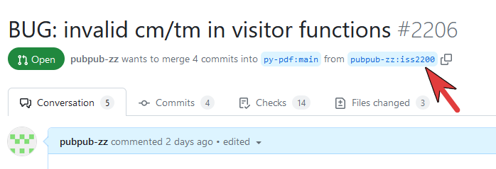

# Testing

pypdf uses [`pytest`](https://docs.pytest.org/en/7.1.x/) for testing.

To run the tests you need to install the CI (Continuous Integration) requirements by running `pip install -r requirements/ci.txt` or
`pip install -r requirements/ci-3.11.txt` if running Python ≥ 3.11.

## Deselecting groups of tests

pypdf makes use of the following pytest markers:

* `slow`: Tests that require more than 5 seconds.
* `samples`: Tests that require the [the `sample-files` git submodule](https://github.com/py-pdf/sample-files) to be initialized. As of October 2022, this is about 25 MB.
* `enable_socket`: Tests that download PDF documents. They are stored locally and thus only need to be downloaded once. As of October 2022, this is about 200 MB.
  * To successfully run the tests, please download most of the documents beforehand: `python -c "from tests import download_test_pdfs; download_test_pdfs()"`

You can disable them by `pytest -m "not enable_socket"` or `pytest -m "not samples"`.
You can even disable all of them: `pytest -m "not enable_socket" -m "not samples" -m "not slow"`.

Please note that this reduces test coverage. The CI will always test all files.

## Docstrings in Unit tests

The first line of a docstring in a unit test should be written in a way that
you could prefix it with "This tests ensures that ...", e.g.

* Invalid XML in xmp_metadata is gracefully handled.
* The identity is returning its input.
* xmp_modify_date is extracted correctly.

This way, plugins like [`pytest-testdox`](https://pypi.org/project/pytest-testdox/)
can generate really nice output when the tests are running. This looks similar
to the output of [mocha.js](https://mochajs.org/).

If the test is a regression test, write

> This test is a regression test for issue #1234

If the regression test is just one parameter of other tests, then add it as
a comment for that parameter.

## Evaluate a PR in-progress version

You may want to test a version from a PR which has not been released yet.
The easiest way is to use pip and install a version from git:

a) Go the PR and identify the repository and branch.

Example from below : repository: __pubpub-zz__ / branch: __iss2200__ :


b) you can then install the version using pip from git:

Example:
```
pip install git+https://github.com/pubpub-zz/pypdf.git@iss2200
```
