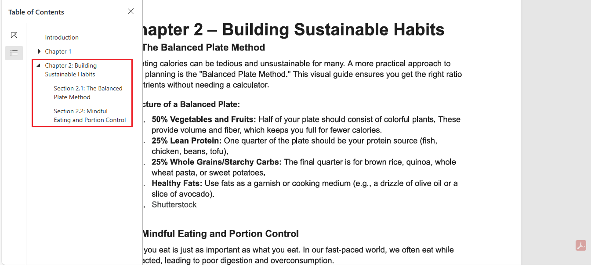

# PDF Outlines

PDF outlines—also known as bookmarks—provide a structured navigation panel in PDF readers. `pypdf` allows you to read, create, and modify both simple and deeply nested outlines.

## Writing PDF Outlines

To add outlines, use the `pypdf.PdfWriter.add_outline_item` method. This method returns a reference to the created outline, which you can use as a parent to create nested (hierarchical) bookmarks.

### Adding a Simple Outline

The following example shows how to add a single top-level bookmark. It uses the `clone_from` parameter to load an existing PDF and copy all its pages and metadata efficiently. We then add an outline item pointing to the first page (index `0`) and save the result.


```{testsetup}
pypdf_test_setup("user/pdf-outlines", {
    "input.pdf": "../resources/input.pdf",
})
```

```{testcode}
from pypdf import PdfWriter

# Open the input PDF and clone its content
writer = PdfWriter(clone_from="input.pdf")

# Add a top-level bookmark
writer.add_outline_item(
    title="Introduction",
    page_number=0
)

# Save the updated PDF
with open("input.pdf", "wb") as f:
    writer.write(f)
```


### Adding Nested Outlines

You can build hierarchies (like Chapter → Section) by passing the parent outline item to the `parent` parameter of a new item.

In the example below, we create a root item "Introduction" and nest two sections under it.

```{testcode}
from pypdf import PdfWriter

writer = PdfWriter(clone_from="input.pdf")

# Add parent (Chapter)
introduction = writer.add_outline_item(
    title="Chapter 1",
    page_number=1
)

# Add children (sections) nested under the introduction
writer.add_outline_item(
    title="Section 1.1",
    page_number=1,
    parent=introduction
)

writer.add_outline_item(
    title="Section 1.2",
    page_number=1,
    parent=introduction
)

with open("input.pdf", "wb") as f:
    writer.write(f)
```


### Advanced Styling and View Modes (Fit Options)

You can customize the appearance and behavior of bookmarks using optional parameters. The `color` argument (a tuple of floats `0.0-1.0`) controls the text color, while `bold` and `italic` control the font style.

The `fit` parameter determines how the page is displayed when the user clicks the bookmark. You can use the `pypdf.generic.Fit` helper to specify modes like `Fit.fit()` (show whole page), `Fit.fit_horizontally()` (fit width), or `Fit.xyz()` (specific zoom and coordinates).


```{testcode}
from pypdf import PdfWriter
from pypdf.generic import Fit

writer = PdfWriter(clone_from="input.pdf")

# Top-level chapter (Points to Page 3, Index 2)
chapter2 = writer.add_outline_item(
    title="Chapter 2: Building Sustainable Habits",
    page_number=2,
    color=(0, 0, 1),
    bold=True,
    italic=False,
    is_open=True,
    fit=Fit.fit()
)

# Section under Chapter 2 (Points to Page 3, Index 2)
section2_1 = writer.add_outline_item(
    title="Section 2.1: The Balanced Plate Method",
    page_number=2,
    parent=chapter2,
    color=(0, 0.5, 0),
    bold=False,
    italic=True,
    is_open=False,
    fit=Fit.fit_horizontally(top=800)
)

# Section with custom zoom (Points to Page 3, Index 2)
section2_2 = writer.add_outline_item(
    title="Section 2.2: Mindful Eating and Portion Control",
    page_number=2,
    parent=chapter2,
    color=(1, 0, 0),
    bold=True,
    italic=True,
    is_open=True,
    fit=Fit.xyz(left=0, top=800, zoom=1.25)
)

with open("input.pdf", "wb") as f:
    writer.write(f)
```




## Reading PDF Outlines

`pypdf` represents outlines as a list of `Destination` objects. If an outline has children, they appear as a nested list directly following their parent.

To retrieve the page number a bookmark points to, use the `reader.get_destination_page_number(outline)` method, which returns a 0-based page index.

### Reading Simple Outlines

To extract only the top-level bookmarks (ignoring nested sections), you can iterate over `reader.outline`. Since nested children appear as lists within the outline structure, you must explicitly check for and skip them (`isinstance(outline, list)`) to avoid errors. The example below reads the file created in the previous section.

```{testcode}
from pypdf import PdfReader

# Read the file
reader = PdfReader("input.pdf")

print("Simple Outline (Top-Level Only):")
print("-" * 30)

for outline in reader.outline:
    # 1. Check if the item is a list (which represents nested children)
    if isinstance(outline, list):
        continue  # Skip the nested parts completely

    # 2. Process only the standard items
    try:
        page_num = reader.get_destination_page_number(outline)
        print(f"{outline.title} -> page {page_num + 1}")
    except Exception:
        pass # Ignore any broken links
```

```{testoutput}
:hide:

Simple Outline (Top-Level Only):
------------------------------
Introduction -> page 1
Chapter 1 -> page 2
Chapter 2: Building Sustainable Habits -> page 3
```

### Reading Nested Outlines

When dealing with hierarchical bookmarks, the `reader.outline` property may contain lists inside lists. You should use a recursive function to traverse the tree.

The following example defines a `print_outline` function that handles indentation and nested lists to display the structure of the document we created earlier.

```{testcode}
from pypdf import PdfReader

def print_outline(outlines, reader, level=0):
    """Recursively print all outline items with indentation."""
    for item in outlines:
        if isinstance(item, list):
            # Recursively handle the nested list of children
            print_outline(item, reader, level + 1)
        else:
            try:
                page_num = reader.get_destination_page_number(item)
            except Exception:
                page_num = None

            indent = "  " * level

            if page_num is None:
                print(f"{indent}- {item.title} (No page destination)")
            else:
                print(f"{indent}- {item.title} (Page {page_num + 1})")

reader = PdfReader("input.pdf")
print_outline(reader.outline, reader)
```

```{testoutput}
:hide:

- Introduction (Page 1)
- Chapter 1 (Page 2)
  - Section 1.1 (Page 2)
  - Section 1.2 (Page 2)
- Chapter 2: Building Sustainable Habits (Page 3)
  - Section 2.1: The Balanced Plate Method (Page 3)
  - Section 2.2: Mindful Eating and Portion Control (Page 3)
```
