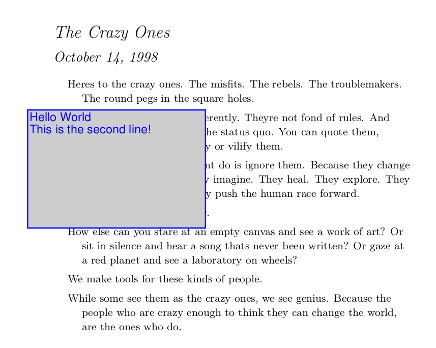

# Adding PDF Annotations

## Attachments

```python
from PyPDF2 import PdfWriter

writer = PdfWriter()
writer.add_blank_page(width=200, height=200)

data = b"any bytes - typically read from a file"
writer.add_attachment("smile.png", data)

with open("output.pdf", "wb") as output_stream:
    writer.write(output_stream)
```


## Free Text

If you want to add text in a box like this



you can use the {py:class}`AnnotationBuilder <PyPDF2.generic.AnnotationBuilder>`:

```python
from PyPDF2 import PdfReader, PdfWriter
from PyPDF2.generic import AnnotationBuilder

# Fill the writer with the pages you want
pdf_path = os.path.join(RESOURCE_ROOT, "crazyones.pdf")
reader = PdfReader(pdf_path)
page = reader.pages[0]
writer = PdfWriter()
writer.add_page(page)

# Create the annotation and add it
annotation = AnnotationBuilder.free_text(
    "Hello World\nThis is the second line!",
    rect=(50, 550, 200, 650),
    font="Arial",
    bold=True,
    italic=True,
    font_size="20pt",
    font_color="00ff00",
    border_color="0000ff",
    bg_color="cdcdcd",
)
writer.add_annotation(page_number=0, annotation=annotation)

# Write the annotated file to disk
with open("annotated-pdf.pdf", "wb") as fp:
    writer.write(fp)
```

## Line

If you want to add a line like this:


you can use the {py:class}`AnnotationBuilder <PyPDF2.generic.AnnotationBuilder>`:

```python
pdf_path = os.path.join(RESOURCE_ROOT, "crazyones.pdf")
reader = PdfReader(pdf_path)
page = reader.pages[0]
writer = PdfWriter()
writer.add_page(page)

# Add the line
annotation = AnnotationBuilder.line(
    text="Hello World\nLine2",
    rect=(50, 550, 200, 650),
    p1=(50, 550),
    p2=(200, 650),
)
writer.add_annotation(page_number=0, annotation=annotation)

# Write the annotated file to disk
with open("annotated-pdf.pdf", "wb") as fp:
    writer.write(fp)
```

## Link

If you want to add a link, you can use
the {py:class}`AnnotationBuilder <PyPDF2.generic.AnnotationBuilder>`:

```python
pdf_path = os.path.join(RESOURCE_ROOT, "crazyones.pdf")
reader = PdfReader(pdf_path)
page = reader.pages[0]
writer = PdfWriter()
writer.add_page(page)

# Add the line
annotation = AnnotationBuilder.link(
    rect=(50, 550, 200, 650),
    url="https://martin-thoma.com/",
)
writer.add_annotation(page_number=0, annotation=annotation)

# Write the annotated file to disk
with open("annotated-pdf.pdf", "wb") as fp:
    writer.write(fp)
```
