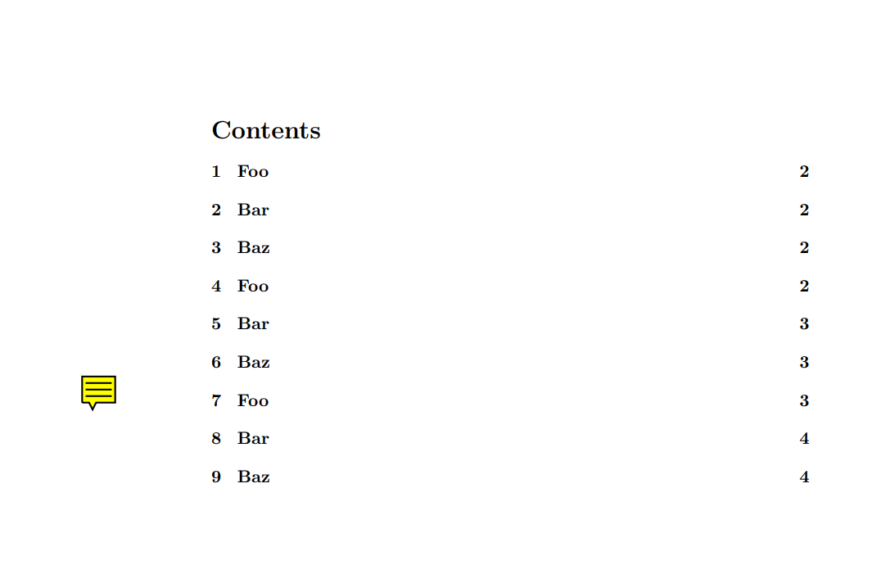
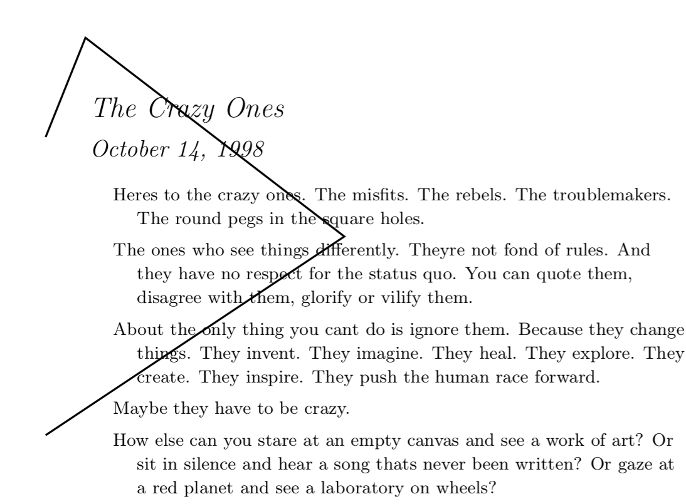
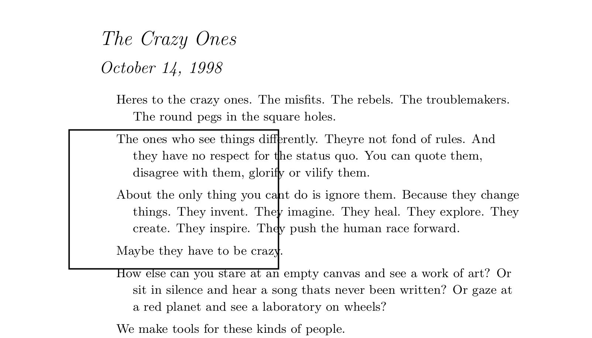
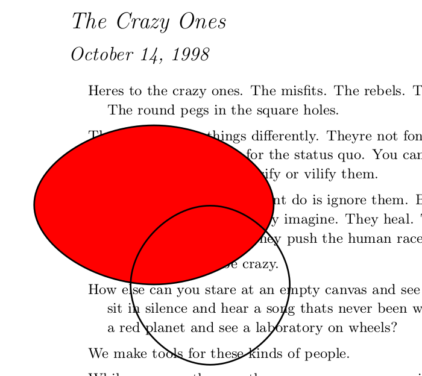
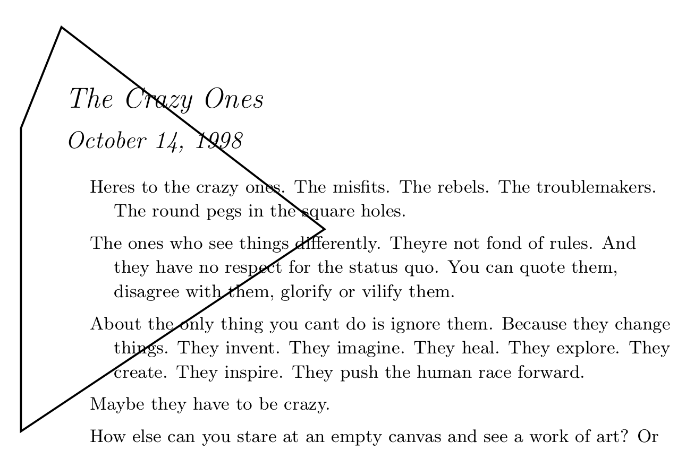

# Adding PDF Annotations

## Attachments

```python
from pypdf import PdfWriter

writer = PdfWriter()
writer.add_blank_page(width=200, height=200)

data = b"any bytes - typically read from a file"
writer.add_attachment("smile.png", data)

with open("output.pdf", "wb") as output_stream:
    writer.write(output_stream)
```


## Free Text

If you want to add text in a box like this


you can use the {py:class}`FreeText <pypdf.annotations.FreeText>`:

```python
from pypdf import PdfReader, PdfWriter
from pypdf.annotations import FreeText

# Fill the writer with the pages you want
pdf_path = os.path.join(RESOURCE_ROOT, "crazyones.pdf")
reader = PdfReader(pdf_path)
page = reader.pages[0]
writer = PdfWriter()
writer.add_page(page)

# Create the annotation and add it
annotation = FreeText(
    text="Hello World\nThis is the second line!",
    rect=(50, 550, 200, 650),
    font="Arial",
    bold=True,
    italic=True,
    font_size="20pt",
    font_color="00ff00",
    border_color="0000ff",
    background_color="cdcdcd",
)
writer.add_annotation(page_number=0, annotation=annotation)

# Write the annotated file to disk
with open("annotated-pdf.pdf", "wb") as fp:
    writer.write(fp)
```

## Text

A text annotation looks like this:



## Line

If you want to add a line like this:


you can use  {py:class}`Line <pypdf.annotations.Line>`:

```python
pdf_path = os.path.join(RESOURCE_ROOT, "crazyones.pdf")
reader = PdfReader(pdf_path)
page = reader.pages[0]
writer = PdfWriter()
writer.add_page(page)

# Add the line
annotation = Line(
    text="Hello World\nLine2",
    rect=(50, 550, 200, 650),
    p1=(50, 550),
    p2=(200, 650),
)
writer.add_annotation(page_number=0, annotation=annotation)

# Write the annotated file to disk
with open("annotated-pdf.pdf", "wb") as fp:
    writer.write(fp)
```

## PolyLine

If you want to add a line like this:



you can use  {py:class}`PolyLine <pypdf.annotations.PolyLine>`:

```python
pdf_path = os.path.join(RESOURCE_ROOT, "crazyones.pdf")
reader = PdfReader(pdf_path)
page = reader.pages[0]
writer = PdfWriter()
writer.add_page(page)

# Add the polyline
annotation = Polyline(
    vertices=[(50, 550), (200, 650), (70, 750), (50, 700)],
)
writer.add_annotation(page_number=0, annotation=annotation)

# Write the annotated file to disk
with open("annotated-pdf.pdf", "wb") as fp:
    writer.write(fp)
```

## Rectangle

If you want to add a rectangle like this:



you can use  {py:class}`Rectangle <pypdf.annotations.Rectangle>`:

```python
pdf_path = os.path.join(RESOURCE_ROOT, "crazyones.pdf")
reader = PdfReader(pdf_path)
page = reader.pages[0]
writer = PdfWriter()
writer.add_page(page)

# Add the rectangle
annotation = Rectangle(
    rect=(50, 550, 200, 650),
)
writer.add_annotation(page_number=0, annotation=annotation)

# Write the annotated file to disk
with open("annotated-pdf.pdf", "wb") as fp:
    writer.write(fp)
```

If you want the rectangle to be filled, use the `interiour_color="ff0000"` parameter.

This method uses the "square" annotation type of the PDF format.


## Ellipse

If you want to add a circle like this:



you can use  {py:class}`Ellipse <pypdf.annotations.Ellipse>`:

```python
pdf_path = os.path.join(RESOURCE_ROOT, "crazyones.pdf")
reader = PdfReader(pdf_path)
page = reader.pages[0]
writer = PdfWriter()
writer.add_page(page)

# Add the rectangle
annotation = Ellipse(
    rect=(50, 550, 200, 650),
)
writer.add_annotation(page_number=0, annotation=annotation)

# Write the annotated file to disk
with open("annotated-pdf.pdf", "wb") as fp:
    writer.write(fp)
```

## Polygon

If you want to add a polygon like this:



you can use  {py:class}`Polygon <pypdf.annotations.Polygon>`:

```python
pdf_path = os.path.join(RESOURCE_ROOT, "crazyones.pdf")
reader = PdfReader(pdf_path)
page = reader.pages[0]
writer = PdfWriter()
writer.add_page(page)

# Add the line
annotation = Polygon(
    vertices=[(50, 550), (200, 650), (70, 750), (50, 700)],
)
writer.add_annotation(page_number=0, annotation=annotation)

# Write the annotated file to disk
with open("annotated-pdf.pdf", "wb") as fp:
    writer.write(fp)
```

## Link

If you want to add a link, you can use
{py:class}`Link <pypdf.annotations.Link>`:

```python
pdf_path = os.path.join(RESOURCE_ROOT, "crazyones.pdf")
reader = PdfReader(pdf_path)
page = reader.pages[0]
writer = PdfWriter()
writer.add_page(page)

# Add the line
annotation = Link(
    rect=(50, 550, 200, 650),
    url="https://martin-thoma.com/",
)
writer.add_annotation(page_number=0, annotation=annotation)

# Write the annotated file to disk
with open("annotated-pdf.pdf", "wb") as fp:
    writer.write(fp)
```

You can also add internal links:

```python
pdf_path = os.path.join(RESOURCE_ROOT, "crazyones.pdf")
reader = PdfReader(pdf_path)
page = reader.pages[0]
writer = PdfWriter()
writer.add_page(page)

# Add the line
annotation = Link(
    rect=(50, 550, 200, 650), target_page_index=3, fit="/FitH", fit_args=(123,)
)
writer.add_annotation(page_number=0, annotation=annotation)

# Write the annotated file to disk
with open("annotated-pdf.pdf", "wb") as fp:
    writer.write(fp)
```
