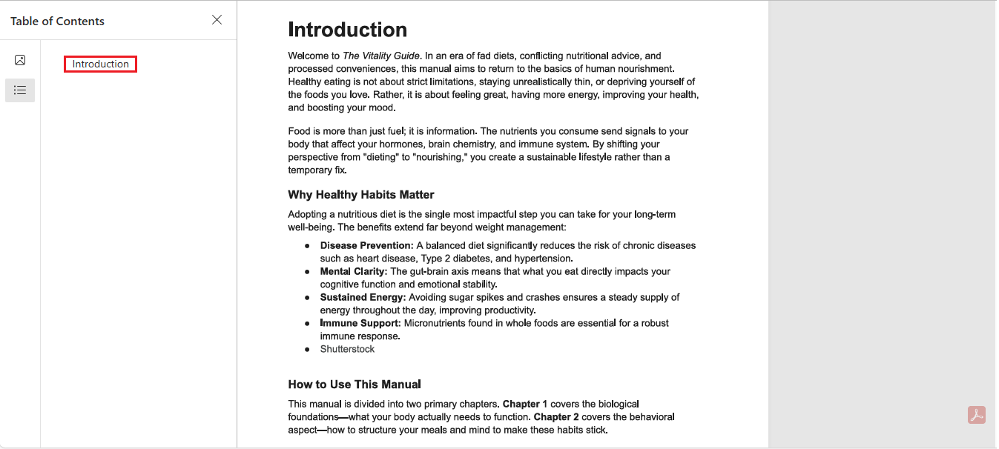
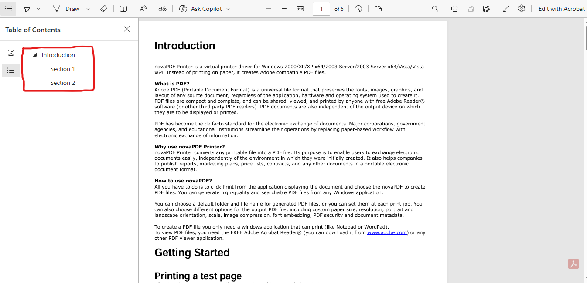

# Adding PDF Outlines

```{note}
PDF outlines — also known as bookmarks — provide a structured navigation panel in PDF readers.
With pypdf, you can create simple or deeply nested outlines programmatically.
```

## `PdfWriter.add_outline_item()`

**Source:** `pypdf/_writer.py`
Adds an outline (bookmark) entry to the PDF document.

## **Syntax**

```python
add_outline_item(
    self,
    title: str,
    page_number: Union[None, PageObject, IndirectObject, int],
    parent: Union[None, TreeObject, IndirectObject] = None,
    before: Union[None, TreeObject, IndirectObject] = None,
    color: Optional[Union[tuple[float, float, float], str]] = None,
    bold: bool = False,
    italic: bool = False,
    fit: Fit = PAGE_FIT,
    is_open: bool = True,
) -> IndirectObject:
```

## Parameters

The following parameters are available for `add_outline_item()`:

| Name          | Type                                             | Default    | Description                                                                                                                        |
| ------------- | ------------------------------------------------ | ---------- | ---------------------------------------------------------------------------------------------------------------------------------- |
| `title`       | `str`                                            | —          | The visible text label shown in the PDF outline panel.                                                                             |
| `page_number` | `None`, `int`, `PageObject`, or `IndirectObject` | —          | Destination page for the outline item. May be set to `None`, making the entry non-clickable and usable as a parent/group node.     |
| `parent`      | `None`, `TreeObject`, or `IndirectObject`        | `None`     | Makes the outline item a child of the given parent outline node. If omitted, it becomes a top-level entry.                         |
| `before`      | `None`, `TreeObject`, or `IndirectObject`        | `None`     | Inserts the outline item before another existing outline item at the same level. Used to control ordering.                         |
| `color`       | `tuple[float, float, float]` or `str`, optional  | `None`     | Sets the outline text color. Tuples must use 0–1 float values (e.g., `(1, 0, 0)` for red). Some named colors may also be accepted. |
| `bold`        | `bool`                                           | `False`    | Displays the outline title in bold.                                                                                                |
| `italic`      | `bool`                                           | `False`    | Displays the outline title in italic.                                                                                              |
| `fit`         | `Fit`                                            | `PAGE_FIT` | Determines how the destination page is displayed (Fit, FitH, FitV, FitR, XYZ, etc.).                                               |
| `is_open`     | `bool`                                           | `True`     | Controls whether the outline node appears expanded in the PDF viewer when opened.                                                  |


### Fit Mode Options

| Fit Method                                    | Meaning                                    |
| --------------------------------------------- | ------------------------------------------ |
| `Fit.fit()`                                   | Display the entire page.                   |
| `Fit.fit_horizontally(top)`                   | Fit page width, aligned at the given top.  |
| `Fit.fit_vertically(left)`                    | Fit page height, aligned at the given left.|
| `Fit.fit_rectangle(left, bottom, right, top)` | Fit a specific rectangular region.         |
| `Fit.xyz(left, top, zoom)`                    | Custom position and zoom level.            |

## **Return Type:** `IndirectObject`

Returns a reference to the created outline item, which can be used when adding nested children.

### Example
```python
chapter = writer.add_outline_item("Chapter 1", page_number=0)
writer.add_outline_item("Section 1.1", page_number=1, parent=chapter)
```

## Exceptions

The `add_outline_item()` method may raise the following exceptions:

| Exception     | When it occurs |
|---------------|----------------|
| `ValueError`  | Raised when `page_number` is out of range, the `fit` argument is invalid, or when the `color` tuple contains values outside the 0–1 float range. |
| `TypeError`   | Raised when arguments such as `parent`, `before`, or `color` are provided using unsupported types. |
| `IndexError`  | May occur if a referenced page index is not available in the document. |

## Example: Full PDF Outline with All Parameters

```{testsetup}
pypdf_test_setup("user/adding-pdf-outlines", {
    "output.pdf": "../resources/output.pdf",
    "example1.pdf": "../resources/example1.pdf",
    "input.pdf": "../resources/input.pdf"

})
```

```{testcode}
from pypdf import PdfReader, PdfWriter
from pypdf.generic._fit import Fit  # Use Fit only

reader = PdfReader("input.pdf")  # Replace with your input PDF
writer = PdfWriter()

# Copy all pages into the writer
for page in reader.pages:
    writer.add_page(page)

# Top-level chapter (blue, bold, expanded)
chapter1 = writer.add_outline_item(
    title="Chapter 1: Introduction",
    page_number=0,
    color=(0, 0, 1),
    bold=True,
    italic=False,
    is_open=True,
    fit=Fit.fit()
)

# Section under Chapter 1 (dark green, italic, collapsed)
section1_1 = writer.add_outline_item(
    title="Section 1.1: Getting Started",
    page_number=1,
    parent=chapter1,
    color=(0, 0.5, 0),
    bold=False,
    italic=True,
    is_open=False,
    fit=Fit.fit_horizontally(top=800)
)

# Section with custom zoom
section1_2 = writer.add_outline_item(
    title="Section 1.2: Printing a Test Page",
    page_number=2,
    parent=chapter1,
    color=(1, 0, 0),
    bold=True,
    italic=True,
    is_open=True,
    fit=Fit.xyz(left=0, top=800, zoom=1.25)
)

# Non-clickable parent (no page number)
appendix = writer.add_outline_item(
    title="Appendices",
    page_number=None,
    color=(0.5, 0, 0.5),
    bold=True,
    italic=False,
    is_open=False
)

# Child under non-clickable parent
writer.add_outline_item(
    title="Appendix A: Extra Data",
    page_number=3,
    parent=appendix,
    color=(0, 0, 0),
    bold=False,
    italic=False,
    is_open=True,
    fit=Fit.fit_vertically(left=50)
)

# Save the PDF
output_path = "output.pdf"
with open(output_path, "wb") as f:
    writer.write(f)
```

### What this code demonstrates

* Adding top-level and nested bookmarks.
* Using all parameters: `title`, `page_number`, `parent`, `color`, `bold`, `italic`, `is_open`, `fit.`
* Creating non-clickable parent nodes (`page_number=None`).
* Using different page view modes: `Fit, FitH, FitV, XYZ.`
* Produces a navigable outline tree in the PDF reader.

## Adding a Simple Outline

Use this when you want a single top-level bookmark pointing to a page.

```{testcode}
from pypdf import PdfReader, PdfWriter

reader = PdfReader("input.pdf")
writer = PdfWriter()

# Copy all pages into the writer
for page in reader.pages:
    writer.add_page(page)

# Add a top-level bookmark
writer.add_outline_item(
    title="Introduction",
    page_number=0  # zero-based index
)

with open("output.pdf", "wb") as f:
    writer.write(f)
```

### What the simple outline code does

* Loads the original PDF
* Copies each page
* Adds an outlines named "Introduction"
* Save the updated PDF



## Adding Nested (Hierarchical) Outlines

Nested outlines create structures like:

```text
Introduction
├── Section 1.1
└── Section 1.2
```

```{testcode}
from pypdf import PdfReader, PdfWriter

reader = PdfReader("input.pdf")
writer = PdfWriter()

# Copy pages
for page in reader.pages:
    writer.add_page(page)

# Add parent (Introduction)
introduction = writer.add_outline_item(
    title="Introduction",
    page_number=0
)

# Add children (sections)
writer.add_outline_item(
    title="Section 1",
    page_number=1,
    parent=introduction
)

writer.add_outline_item(
    title="Section 2",
    page_number=2,
    parent=introduction
)

with open("output.pdf", "wb") as f:
    writer.write(f)
```


### What the nested outline code does

* Copies all pages into the new PDF
* Creates a top-level outline called Introduction
* Adds Section 1 under that Introduction
* Adds Section 2 under the same Introduction
* Produces an outline tree like:



### Key points

- `parent=` creates nested outlines — without it, all outlines become top level.
- `page_number` is zero-based (`0` = first page).
- You must **add pages before** adding outlines — otherwise bookmarks won’t work.
- You can build multiple hierarchical levels (chapter → section → subsection → etc.).
- A bookmark must point to a valid page, or the PDF reader may hide or ignore it.
- Nested outlines improve navigation for large PDFs.
