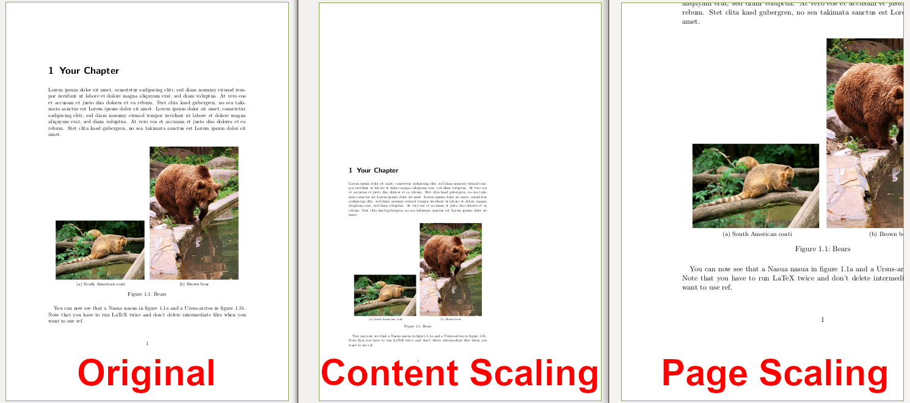

# Cropping and Transforming PDFs

```python
from PyPDF2 import PdfWriter, PdfReader

reader = PdfReader("example.pdf")
writer = PdfWriter()

# add page 1 from reader to output document, unchanged:
writer.add_page(reader.pages[0])

# add page 2 from reader, but rotated clockwise 90 degrees:
writer.add_page(reader.pages[1].rotate(90))

# add page 3 from reader, but crop it to half size:
page3 = reader.pages[2]
page3.mediabox.upper_right = (
    page3.mediabox.right / 2,
    page3.mediabox.top / 2,
)
writer.add_page(page3)

# add some Javascript to launch the print window on opening this PDF.
# the password dialog may prevent the print dialog from being shown,
# comment the the encription lines, if that's the case, to try this out:
writer.add_js("this.print({bUI:true,bSilent:false,bShrinkToFit:true});")

# write to document-output.pdf
with open("PyPDF2-output.pdf", "wb") as fp:
    writer.write(fp)
```

## Page rotation

The most typical rotation is a clockwise rotation of the page by multiples of
90 degrees. That is done when the orientation of the page is wrong. You can
do that with the [`rotate` method](https://pypdf2.readthedocs.io/en/latest/modules/PageObject.html#PyPDF2._page.PageObject.rotate)
of the `PageObject` class:

```python
from PyPDF2 import PdfWriter, PdfReader

reader = PdfReader("input.pdf")
writer = PdfWriter()


writer.add_page(reader.pages[0])
writer.pages[0].rotate(90)

with open("output.pdf", "wb") as fp:
    writer.write(fp)
```

The rotate method is typically preferred over the `page.add_transformation(Transformation().rotate())`
method, because `rotate` will ensure that the page is still in the mediabox /
cropbox. The transformation object operates on the coordinates of the pages
contents and does not change the mediabox or cropbox.


## Plain Merge


is the result of

```python
from PyPDF2 import PdfReader, PdfWriter, Transformation

# Get the data
reader_base = PdfReader("labeled-edges-center-image.pdf")
page_base = reader_base.pages[0]

reader = PdfReader("box.pdf")
page_box = reader.pages[0]

page_base.merge_page(page_box)

# Write the result back
writer = PdfWriter()
writer.add_page(page_base)
with open("merged-foo.pdf", "wb") as fp:
    writer.write(fp)
```

## Merge with Rotation


```python
from PyPDF2 import PdfReader, PdfWriter, Transformation

# Get the data
reader_base = PdfReader("labeled-edges-center-image.pdf")
page_base = reader_base.pages[0]

reader = PdfReader("box.pdf")
page_box = reader.pages[0]

# Apply the transformation
transformation = Transformation().rotate(45)
page_box.add_transformation(transformation)
page_base.merge_page(page_box)

# Write the result back
writer = PdfWriter()
writer.add_page(page_base)
with open("merged-foo.pdf", "wb") as fp:
    writer.write(fp)
```

If you add the expand parameter:

```python
transformation = Transformation().rotate(45)
page_box.add_transformation(transformation)
page_base.merge_page(page_box)
```

you get:


Alternatively, you can move the merged image a bit to the right by using

```python
op = Transformation().rotate(45).translate(tx=50)
```


## Scaling

PyPDF2 offers two ways to scale: The page itself and the contents on a page.
Typically, you want to combine both.



### Scaling a Page (the Canvas)

```python
from PyPDF2 import PdfReader, PdfWriter

# Read the input
reader = PdfReader("resources/side-by-side-subfig.pdf")
page = reader.pages[0]

# Scale
page.scale_by(0.5)

# Write the result to a file
writer = PdfWriter()
writer.add_page(page)
writer.write("out.pdf")
```

If you wish to have more control, you can adjust the various page boxes
directly:

```python
from PyPDF2.generic import RectangleObject

mb = page.mediabox

page.mediabox = RectangleObject((mb.left, mb.bottom, mb.right, mb.top))
page.cropbox = RectangleObject((mb.left, mb.bottom, mb.right, mb.top))
page.trimbox = RectangleObject((mb.left, mb.bottom, mb.right, mb.top))
page.bleedbox = RectangleObject((mb.left, mb.bottom, mb.right, mb.top))
page.artbox = RectangleObject((mb.left, mb.bottom, mb.right, mb.top))
```

### Scaling the content

The content is scaled towords the origin of the coordinate system. Typically,
that is the lower-left corner.

```python
from PyPDF2 import PdfReader, PdfWriter, Transformation

# Read the input
reader = PdfReader("resources/side-by-side-subfig.pdf")
page = reader.pages[0]

# Scale
op = Transformation().scale(sx=0.7, sy=0.7)
page.add_transformation(op)

# Write the result to a file
writer = PdfWriter()
writer.add_page(page)
writer.write("out-pg-transform.pdf")
```
