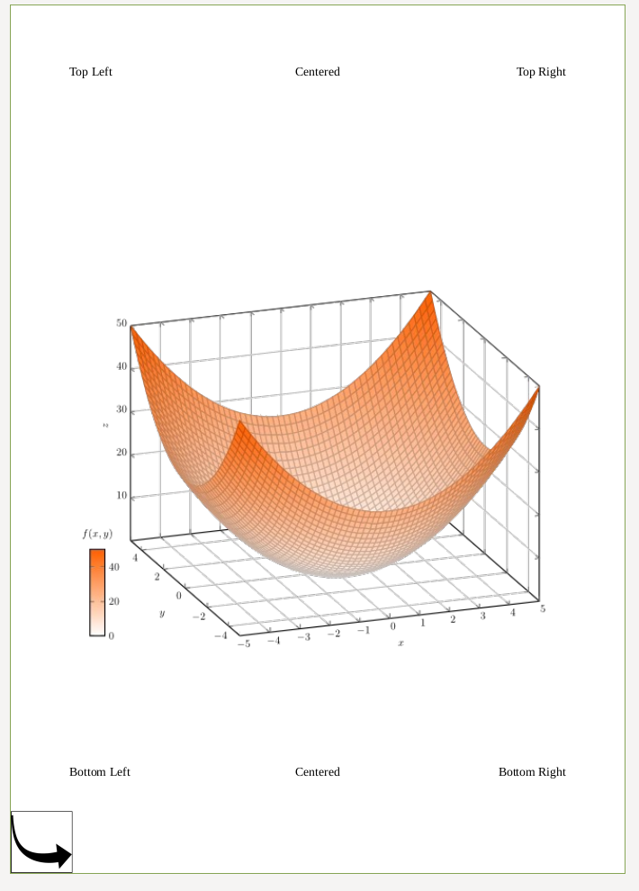
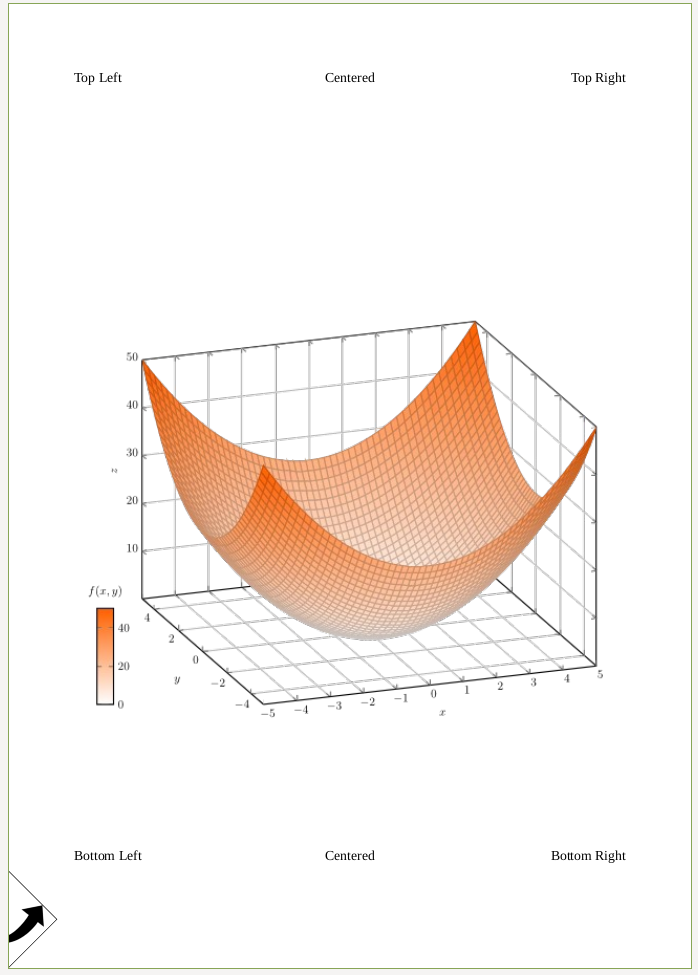
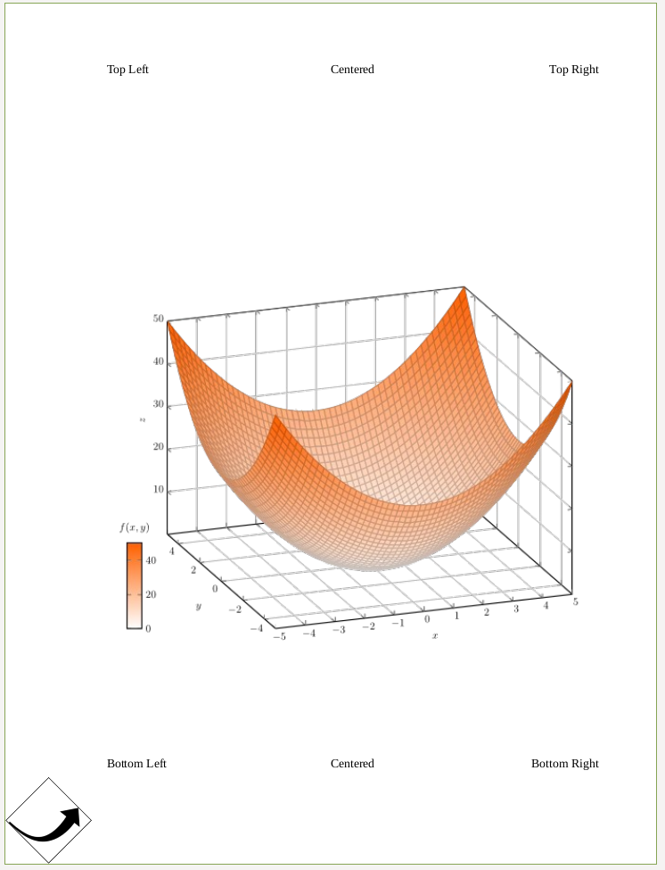
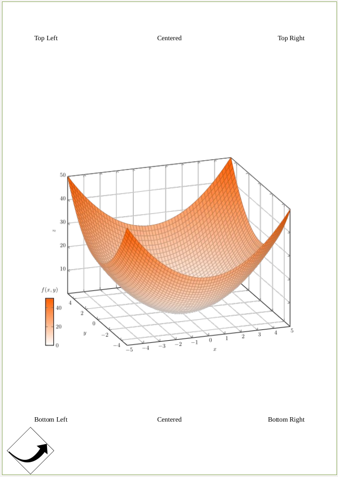

# Cropping and Transforming PDFs

```python
from PyPDF2 import PdfWriter, PdfReader

reader = PdfReader("example.pdf")
writer = PdfWriter()

# add page 1 from reader to output document, unchanged:
writer.add_page(reader.pages[0])

# add page 2 from reader, but rotated clockwise 90 degrees:
writer.add_page(reader.pages[1].rotate_clockwise(90))

# add page 3 from reader, but crop it to half size:
page3 = reader.pages[2]
page3.mediabox.upper_right = (
    page3.mediabox.right / 2,
    page3.mediabox.top / 2,
)
writer.add_page(page3)

# add some Javascript to launch the print window on opening this PDF.
# the password dialog may prevent the print dialog from being shown,
# comment the the encription lines, if that's the case, to try this out:
writer.add_js("this.print({bUI:true,bSilent:false,bShrinkToFit:true});")

# write to document-output.pdf
with open("PyPDF2-output.pdf", "wb") as fp:
    writer.write(fp)
```

## Plain Merge



is the result of

```python
from PyPDF2 import PdfReader, PdfWriter, Transformation

# Get the data
reader_base = PdfReader("labeled-edges-center-image.pdf")
page_base = reader_base.pages[0]

reader = PdfReader("box.pdf")
page_box = reader.pages[0]

page_base.merge_page(page_box)

# Write the result back
writer = PdfWriter()
writer.add_page(page_base)
with open("merged-foo.pdf", "wb") as fp:
    writer.write(fp)
```

## Merge with Rotation



```python
from PyPDF2 import PdfReader, PdfWriter, Transformation

# Get the data
reader_base = PdfReader("labeled-edges-center-image.pdf")
page_base = reader_base.pages[0]

reader = PdfReader("box.pdf")
page_box = reader.pages[0]

# Apply the transformation
transformation = Transformation().rotate(45)
page_box.add_transformation(transformation)
page_base.merge_page(page_box)

# Write the result back
writer = PdfWriter()
writer.add_page(page_base)
with open("merged-foo.pdf", "wb") as fp:
    writer.write(fp)
```

If you add the expand parameter:

```python
transformation = Transformation().rotate(45)
page_box.add_transformation(transformation)
page_base.merge_page(page_box)
```

you get:



Alternatively, you can move the merged image a bit to the right by using

```python
op = Transformation().rotate(45).translate(tx=50)
```


